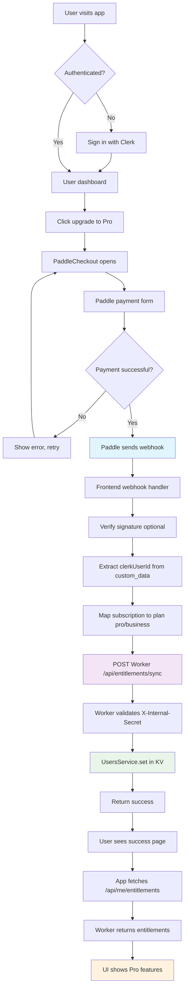

## Paddle + Clerk Integration Plan (GPT-5)

### Objective
Unify authentication (Clerk) with billing (Paddle) without storing subscription state inside Clerk. Clerk is for identity only; subscriptions and usage live in our backend (Cloudflare Worker) using KV. The frontend forwards Paddle webhooks and queries entitlements from the backend to gate UI and API access.

### Principles
- **Clerk for identity only**: do not persist plan/usage in Clerk metadata.
- **Single source of truth**: entitlements stored in KV (`ENTITLEMENTS`) in the Worker.
- **Minimal coupling**: Paddle events → Next.js webhook → signed internal call → Worker updates KV.
- **Defense-in-depth**: verify Paddle signature; sign internal sync with shared secret; never trust client-supplied `userId` without server checks.

## Architecture

### Components
- **Frontend (Next.js)**
  - `PaddleProvider` and `PaddleCheckout` initialize Paddle and pass `customData = { clerkUserId }`.
  - API route `POST /api/webhook` receives Paddle webhooks; verifies and forwards minimal fields to Worker using `X-Internal-Secret`.
  - API route `GET /api/me/entitlements` calls Worker to fetch current user entitlements for gating UI.

- **Backend (Cloudflare Worker / Hono)**
  - `ENTITLEMENTS` KV namespace to persist user plan and status.
  - `POST /api/entitlements/sync` (internal-only) to update a user’s plan based on webhook events.
  - `GET /api/entitlements/:userId` (internal-only) to read entitlements.

### Data Model (KV: `ENTITLEMENTS`)
```json
{
  "userId": "usr_123",
  "plan": "free" | "pro" | "business",
  "status": "none" | "trialing" | "active" | "past_due" | "canceled",
  "provider": "paddle",
  "meta": {
    "subscriptionId": "sub_...",
    "customerId": "ctm_...",
    "currency": "USD",
    "unitPrice": 1900,
    "periodEnd": "2025-01-01T00:00:00Z"
  },
  "updatedAt": "ISO8601"
}
```

## Environment Variables & Config

### Backend (`wrangler.toml`)
```toml
[[kv_namespaces]]
binding = "ENTITLEMENTS"
id = "REPLACE_WITH_KV_ID"

[vars]
INTERNAL_API_SECRET = "set-with-wrangler-or-env"
```

Required secrets/vars (set via `npx wrangler secret put` when applicable):
- `INTERNAL_API_SECRET` (shared with frontend)
- Existing: `OPENAI_API_KEY`, R2 credentials, etc.

### Frontend (Next.js `.env.local`)
```bash
NEXT_PUBLIC_PADDLE_ENV=sandbox
NEXT_PUBLIC_PADDLE_CLIENT_TOKEN=...
WORKER_BASE_URL=https://<your-worker>.workers.dev
INTERNAL_API_SECRET=match_worker_value

# Clerk standard envs already configured (publishable and secret keys)
```

## Implementation Steps

### 1) Backend: KV, service, and routes
1. Add `ENTITLEMENTS` KV to `wrangler.toml` and set `INTERNAL_API_SECRET`.
2. Create `UsersService` to read/write entitlements:
   - `get(userId)` → returns parsed KV value or null
   - `set(userId, data)` → merges and persists `{ plan, status, provider, meta, updatedAt }`
3. Handlers (`src/handlers/users.js`):
   - `handleSyncEntitlements(c)` → `POST /api/entitlements/sync`
     - Auth: require header `X-Internal-Secret === INTERNAL_API_SECRET`
     - Body: `{ userId, plan, status, provider='paddle', meta={} }`
     - Persist via `UsersService.set`
   - `handleGetEntitlements(c)` → `GET /api/entitlements/:userId`
     - Auth: same header check
     - Returns `{ entitlements }` or default `{ plan: 'free', status: 'none' }`
4. Wire routes in `src/index.js`.

### 2) Frontend: Paddle checkout + webhooks + entitlements API
1. `PaddleCheckout`
   - Use Clerk `useUser()` to get `user.id` and email.
   - Pass `checkoutOptions.customer.email` and `checkoutOptions.customData = { clerkUserId: user.id }`.
2. `POST /api/webhook` (Paddle)
   - Read raw body and header `paddle-signature`.
   - Verify signature with `PADDLE_NOTIFICATION_WEBHOOK_SECRET` (enable when configured).
   - Parse event; for `subscription.created|updated|canceled`:
     - Extract `userId` from `custom_data` or fallback by email (optional).
     - Compute new `{ plan, status }` (treat `active|trialing|past_due` as plan `pro`).
     - `fetch("${WORKER_BASE_URL}/api/entitlements/sync", { method: 'POST', headers: { 'X-Internal-Secret': INTERNAL_API_SECRET }, body: {...} })`.
3. `GET /api/me/entitlements`
   - Server route uses `auth()` to get Clerk `userId`.
   - Calls Worker `GET /api/entitlements/:userId` with `X-Internal-Secret`.
   - Returns `{ entitlements }` to the client.

### 3) UI and API gating
- Client components fetch `/api/me/entitlements` (no-store) and gate features based on `entitlements.plan`.
- Server handlers (e.g., creating jobs) should enforce entitlements before proceeding (either in Next.js server route or on the Worker side with a signed token flow).

## Event Mapping (Paddle → Entitlements)

- `subscription.created`
  - status: `trialing|active` → plan=`pro`
  - sync meta: `subscriptionId`, `customerId`, `currency`, `unitPrice`, `periodEnd`

- `subscription.updated`
  - status: `active|trialing|past_due` → plan=`pro`
  - else → plan=`free`

- `subscription.canceled`
  - plan=`free`; status=`canceled` (or keep `active` until period end; configurable)

- `transaction.completed`
  - optional: record one-time purchases and top up usage counters

## API Contracts

### Frontend → Worker (internal-only)
```http
POST /api/entitlements/sync
Headers: X-Internal-Secret: <secret>
Body: {
  "userId": "usr_123",
  "plan": "pro",
  "status": "active",
  "provider": "paddle",
  "meta": { "subscriptionId": "sub_..." }
}
Response: { "ok": true, "entitlements": { ... } }
```

```http
GET /api/entitlements/:userId
Headers: X-Internal-Secret: <secret>
Response: { "entitlements": { ... } }
```

### Paddle → Frontend
```http
POST /api/webhook  (raw body, header: paddle-signature)
```

## Security
- Enable Paddle webhook signature verification.
- Use shared secret `X-Internal-Secret` between Next.js and Worker.
- Do not accept `userId` from the browser for entitlements mutations.
- Optional: replace shared secret with HMAC of payload and rotating key; or use mTLS between edge services if available.

## Testing Checklist
1. Paddle sandbox product + price created; update `priceId` in `src/lib/pricing.js`.
2. Run a sandbox checkout:
   - Verify webhook received and signature check passes (when enabled).
   - Confirm Next.js forwarded entitlements to Worker and KV updated.
3. Reload app while signed in:
   - `GET /api/me/entitlements` returns `plan = pro`.
   - UI shows Pro features; API allows Pro-only endpoints.
4. Cancel subscription in dashboard:
   - Webhook updates plan to `free` (or at period end if configured).
5. Edge cases: `past_due`, `trialing`, invalid signature, missing `custom_data`.

## Rollout Plan
1. Ship backend routes behind shared secret; deploy Worker.
2. Ship frontend webhook forwarding + entitlements read route; deploy.
3. Turn on Paddle signature verification in production.
4. Migrate UI gating to use entitlements instead of Clerk metadata.
5. Monitor logs and add alerts for webhook failures.

## User Flow Diagram



## Integration Status

✅ **Backend (Cloudflare Worker)**
- ENTITLEMENTS KV namespace created and configured
- UsersService for entitlements management
- Internal API routes with X-Internal-Secret authentication
- Routes: POST /api/entitlements/sync, GET /api/entitlements/:userId

✅ **Frontend (Next.js)**
- Environment variables simplified (only INTERNAL_API_SECRET needed)
- **OPTIMIZED**: All Worker APIs (including entitlements) proxied via next.config.mjs
- Frontend API routes (webhook, /api/me/*) handled locally by Next.js
- Paddle webhook handler with entitlements sync via proxy
- User entitlements API route: GET /api/me/entitlements via proxy
- PaddleCheckout component with Clerk integration
- Clerk user ID passed in customData to Paddle

✅ **Data Flow**
- Paddle → Next.js webhook → Worker KV storage
- Worker → Next.js API → Client for entitlements reading
- Single source of truth in Worker KV
- Defense-in-depth with shared secrets

## Testing Instructions

### Prerequisites
1. Set Worker `INTERNAL_API_SECRET`: `npx wrangler secret put INTERNAL_API_SECRET`
2. Match secret in frontend `.env`: `INTERNAL_API_SECRET=same_value`
3. Update Paddle price IDs in `src/lib/pricing.js` with real sandbox IDs

### Test Scenarios
1. **New subscription**: User purchases → webhook → entitlements updated to 'pro'
2. **Subscription update**: Plan change → webhook → entitlements reflect new plan
3. **Cancellation**: Cancel subscription → webhook → entitlements revert to 'free'
4. **App reload**: Refresh page → `/api/me/entitlements` shows correct plan
5. **Authentication**: Signed-out users see "Sign In Required" on checkout

## Future Enhancements
- Usage metering in `meta.usage` (e.g., minutes or jobs); increment from Worker pipeline.
- Customer portal link (Paddle) on settings page.
- Email notifications on plan change.
- Replace shared secret with signed tokens/HMAC and include event replay protection (idempotency key).


