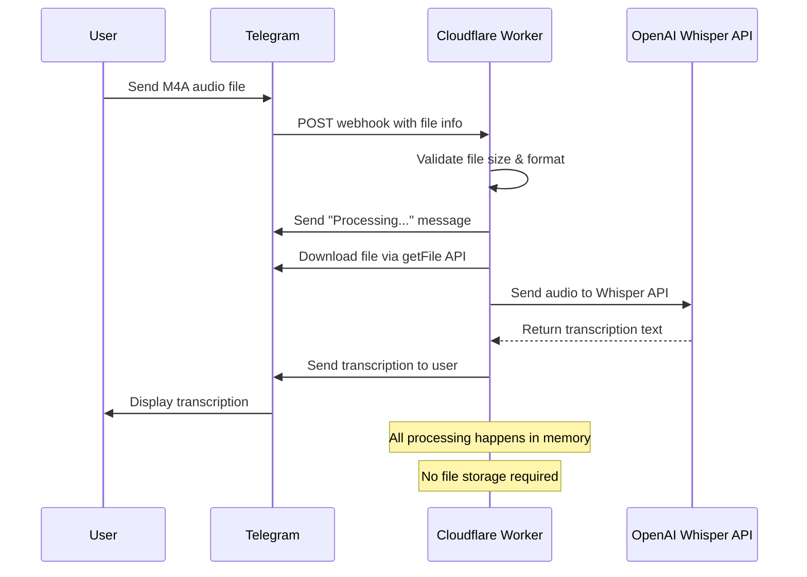

# M4A to Notes Transcriber Implementation Plan

## Overview
Create a Telegram bot that receives M4A audio files and returns transcriptions using OpenAI's Whisper API.

## Architecture
- **Backend**: Cloudflare Workers (Serverless)
- **Bot Framework**: Custom Telegram webhook handler
- **Transcription**: OpenAI Whisper API
- **File Handling**: In-memory processing (no persistent storage)

## Request Flow



## Implementation Steps

### 1. Project Setup
- Initialize Node.js project with `npm init`
- Install dependencies:
  - `wrangler` - Cloudflare Workers CLI (dev dependency)
  - `openai` - OpenAI API client
- Configure `wrangler.toml` for Workers deployment

### 2. Environment Configuration
- Configure environment variables in `wrangler.toml`:
  - `TELEGRAM_BOT_TOKEN` - Bot token from @BotFather
  - `OPENAI_API_KEY` - OpenAI API key
- For production, use `wrangler secret put` commands

### 3. Core Components

#### Cloudflare Worker Handler
- Handle incoming webhook POST requests
- Parse Telegram update payloads
- Route commands (`/start`, `/help`)
- Process audio file messages

#### File Processing
- Download M4A files from Telegram API
- Process files in memory (no disk storage)
- Validate file format and size limits (25MB)
- Handle multiple audio formats (audio, voice, document)

#### Whisper Integration
- Configure OpenAI client for Workers environment
- Send audio buffer to Whisper API
- Handle API responses and errors
- Return transcription to user via Telegram

#### Error Handling
- API rate limiting
- File size validation (25MB Whisper limit)
- Network errors
- Invalid file formats

### 4. File Structure
```
m4a-to-notes/
├── src/
│   └── index.js          # Main Cloudflare Worker
├── wrangler.toml         # Worker configuration
├── .env.example          # Environment template
├── .gitignore
├── package.json
└── IMPLEMENTATION_PLAN.md
```

### 5. Key Features
- Support for M4A audio files
- Automatic transcription with Whisper
- Error messages for unsupported formats
- File cleanup after processing
- Rate limiting protection
- Progress indicators for long files

### 6. Security Considerations
- Validate file types before processing
- Implement file size limits
- Secure API key storage
- Clean up temporary files
- Input sanitization

### 7. Testing Strategy
- Unit tests for core functions
- Integration tests with mock APIs
- Manual testing with various M4A files
- Error scenario testing

### 8. Deployment Options
- **Local Development**: `npx wrangler dev --local`
- **Cloudflare Workers**: `npx wrangler deploy`
- **Custom Domain**: Configure via Cloudflare Dashboard
- **Environment Variables**: Use `wrangler secret put` for production

## Next Steps
1. ✅ Set up Cloudflare Workers project structure
2. ✅ Configure environment variables in wrangler.toml
3. ✅ Implement Telegram webhook handler
4. ✅ Add Whisper API integration
5. 🔄 Test with sample M4A files locally
6. ⏳ Deploy to Cloudflare Workers
7. ⏳ Configure Telegram webhook URL