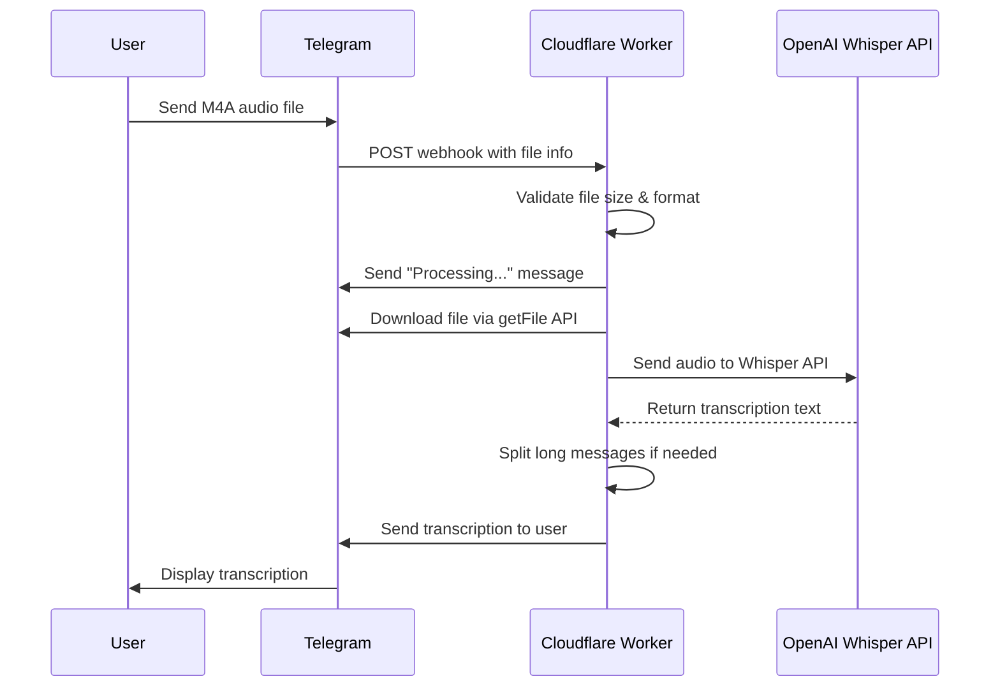

# M4A to Notes Transcriber Bot

A Telegram bot that transcribes M4A audio files using OpenAI's Whisper API, deployed on Cloudflare Workers.

## Features

- 🎙️ **Audio Transcription**: Converts M4A audio files to text using OpenAI Whisper
- ⚡ **Serverless**: Runs on Cloudflare Workers for fast global performance
- 📱 **Telegram Integration**: Simple bot interface for easy file uploads
- 🔄 **Smart Message Splitting**: Automatically splits long transcriptions into readable parts
- 📊 **Structured Logging**: Comprehensive logging with request tracking
- 🌍 **Multi-language Support**: Whisper supports 99+ languages
- 💰 **Cost Effective**: Pay-per-use pricing with Cloudflare Workers

## Quick Start

### Prerequisites

- [Node.js](https://nodejs.org/) (v18+)
- [Cloudflare account](https://cloudflare.com)
- [Telegram Bot Token](https://core.telegram.org/bots#botfather)
- [OpenAI API Key](https://platform.openai.com/api-keys)

### Installation

1. **Clone the repository**
   ```bash
   git clone <repository-url>
   cd m4a-to-notes
   ```

2. **Install dependencies**
   ```bash
   npm install
   ```

3. **Configure environment variables**
   ```bash
   cp .env.example .env
   # Edit wrangler.toml with your tokens (for development)
   ```

### Development

1. **Start local development server**
   ```bash
   npx wrangler dev --local
   ```

2. **Test the bot locally**
   - Your bot will be available at `http://localhost:8787`
   - For Telegram webhook testing, use Cloudflare Tunnel:
     ```bash
     # Install cloudflared if not already installed
     # macOS: brew install cloudflare/cloudflare/cloudflared
     # Windows/Linux: https://developers.cloudflare.com/cloudflare-one/connections/connect-apps/install-and-setup/
     
     cloudflared tunnel --url http://localhost:8787
     ```
   
   This will give you a public URL like `https://random-words.trycloudflare.com` that tunnels to your local development server.

### Production Deployment

1. **Authenticate with Cloudflare**
   ```bash
   npx wrangler login
   ```

2. **Set production secrets**
   ```bash
   npx wrangler secret put TELEGRAM_BOT_TOKEN
   npx wrangler secret put OPENAI_API_KEY
   ```

3. **Deploy to Cloudflare Workers**
   ```bash
   npx wrangler deploy
   ```

4. **Configure Telegram webhook**
   ```bash
   # For production deployment
   curl -X POST "https://api.telegram.org/bot<YOUR_BOT_TOKEN>/setWebhook" \
   -H "Content-Type: application/json" \
   -d '{"url": "https://your-worker-name.your-subdomain.workers.dev"}'
   
   # For local testing with cloudflared tunnel
   curl -X POST "https://api.telegram.org/bot<YOUR_BOT_TOKEN>/setWebhook" \
   -H "Content-Type: application/json" \
   -d '{"url": "https://your-tunnel-url.trycloudflare.com"}'
   ```

## Usage

1. **Start the bot**: Send `/start` to your Telegram bot
2. **Upload audio**: Send an M4A audio file (up to 25MB)
3. **Get transcription**: Receive the transcribed text automatically

### Supported Commands

- `/start` - Welcome message and instructions
- `/help` - Show help information

### Supported File Types

- **M4A** - Primary format (recommended)
- **Voice messages** - Telegram voice recordings
- **Audio documents** - Various audio formats

## Architecture



## Configuration

### Environment Variables

| Variable | Description | Required |
|----------|-------------|----------|
| `TELEGRAM_BOT_TOKEN` | Bot token from @BotFather | ✅ |
| `OPENAI_API_KEY` | OpenAI API key | ✅ |
| `LOG_LEVEL` | Logging level (ERROR, WARN, INFO, DEBUG) | ❌ |
| `NODE_ENV` | Environment (development, production) | ❌ |

### Limits

- **File Size**: 25MB (Whisper API limit)
- **Message Length**: 4096 characters (auto-split for longer texts)
- **Processing Time**: ~30-60 seconds for typical audio files

## Logging

The application provides structured JSON logging with:

- **Request tracking** with unique IDs
- **Performance metrics** for downloads and transcriptions
- **Error handling** with full context
- **Telegram API interaction** logs

### Log Levels

- `ERROR`: Failed operations, API errors
- `WARN`: File size limits, no speech detected
- `INFO`: Successful operations, processing status
- `DEBUG`: Detailed API calls, file processing

## Cost Estimation

### Cloudflare Workers
- **Free Tier**: 100,000 requests/day
- **Paid**: $0.50 per million requests

### OpenAI Whisper API
- **Price**: $0.006 per minute of audio
- **Example**: 10-minute audio = $0.06

## Troubleshooting

### Common Issues

1. **"Bot token not found"**
   - Verify `TELEGRAM_BOT_TOKEN` is set correctly
   - Check token format: `123456789:ABCDEF...`

2. **"OpenAI API error"**
   - Verify `OPENAI_API_KEY` is valid
   - Check OpenAI account has sufficient credits

3. **"File too large"**
   - Maximum file size is 25MB
   - Compress audio or use shorter recordings

4. **"No speech detected"**
   - Ensure audio contains clear speech
   - Check audio isn't corrupted or silent

### Debugging

Enable debug logging:
```bash
npx wrangler secret put LOG_LEVEL
# Enter: DEBUG
```

View logs:
```bash
npx wrangler tail
```

## Development

### Project Structure

```
m4a-to-notes/
├── src/
│   ├── index.js          # Main Cloudflare Worker
│   └── logger.js         # Structured logging utility
├── wrangler.toml         # Worker configuration
├── package.json
├── .env.example
└── README.md
```

### Adding Features

1. **New Commands**: Add handlers in `handleTelegramUpdate()`
2. **File Formats**: Extend validation in file processing
3. **Custom Responses**: Modify message templates
4. **Error Handling**: Add specific error cases

## Contributing

1. Fork the repository
2. Create a feature branch: `git checkout -b feature/new-feature`
3. Commit changes: `git commit -am 'Add new feature'`
4. Push to branch: `git push origin feature/new-feature`
5. Submit a Pull Request

## License

This project is licensed under the ISC License - see the [LICENSE](LICENSE) file for details.

## Support

- 📖 [Cloudflare Workers Docs](https://developers.cloudflare.com/workers/)
- 🤖 [Telegram Bot API](https://core.telegram.org/bots/api)
- 🎙️ [OpenAI Whisper API](https://platform.openai.com/docs/guides/speech-to-text)

## Acknowledgments

- OpenAI for the Whisper API
- Cloudflare for the Workers platform
- Telegram for the Bot API